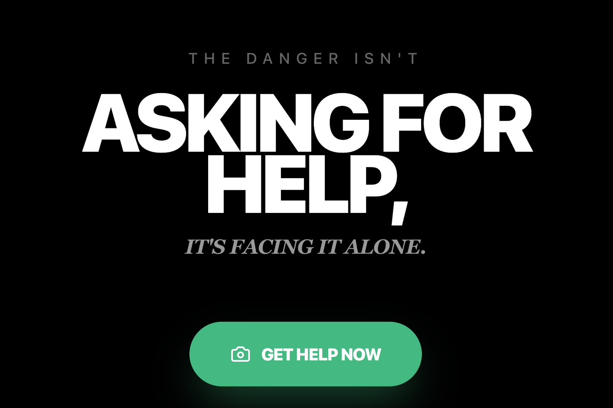

# DailyHero - AI That Speaks When You Can't

When choking steals your voice, AI becomes your lifeline.

DailyHero is an emergency response app that actively detects choking emergencies and coordinates rescue—without waiting for you to ask. Built with Google Gemini Live API for the Gemini Live Agent Challenge.

## 🚨 What It Does

- **Detects emergencies** through real-time video analysis
- **Calls for help** when you can't speak
- **Guides bystanders** through life-saving procedures
- **Communicates with emergency services** on your behalf
- **Thanks everyday heroes** who help save your life
  

## 🚀 Try It Yourself

Want to see how it works? Run it locally!

**Prerequisites:**  Node.js

1. Install dependencies:
   `npm install`
2. Set the `GEMINI_API_KEY` in [.env.local](.env.local) to your Gemini API key
3. Run the app:
   `npm run dev`
4. Test it out:
   Open your browser and try the choking detection demo (Please don't actually choke).
   

## 💡 The Story

After a car accident left me panicking alone in a foreign country, I realized: AI shouldn't wait to be asked. This app is my answer to that moment—an AI that shows up when you need it most, turning strangers into daily heroes.

## 🔗 Links

- [Watch the Demo Video](https://youtu.be/mX9KOLdbk9o)
- [View in AI Studio](https://ai.studio/apps/d7b0b806-b4ef-49b3-a0d4-02c2bc4bb2d1)
- Gemini Live Agent Challenge Submission

---

**Built solo with patience, Google AI Studio, and way too many fake choking attempts.**

Hope everyone stays healthy, but if you ever need help, let AI be your bridge to daily heroes. 💙
